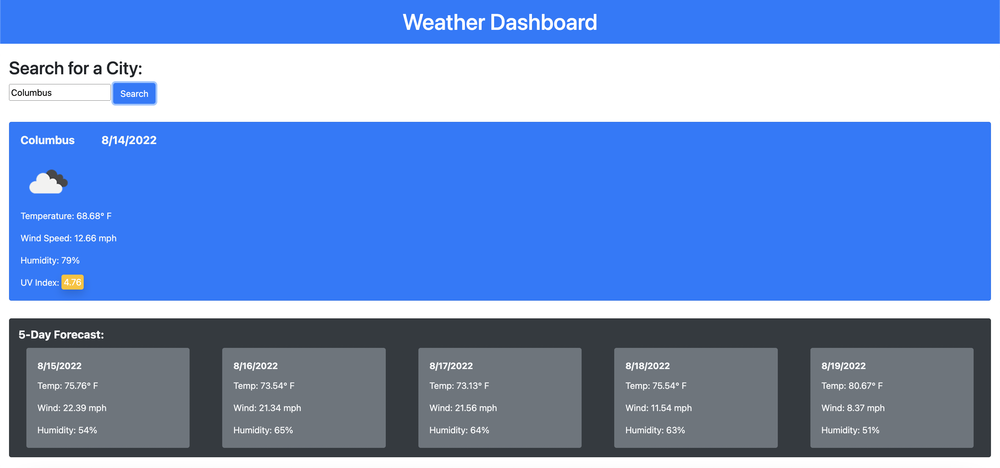

# Weather Dashboard

## Description

This application allows users to search cities and receive current weather information as well as a 5 day forecast. Info includes temperature, humidity, wind speed and UV index.

## Features

- HTML
- CSS & Bootstrap
- JavaScript

## APIs

- Open Weather Map

## Links

Repo: https://github.com/cmdebrosse/weather-dashboard

Page: https://cmdebrosse.github.io/weather-dashboard/

## Screenshot

